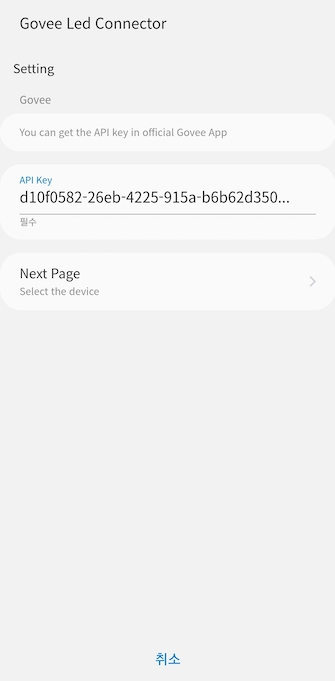
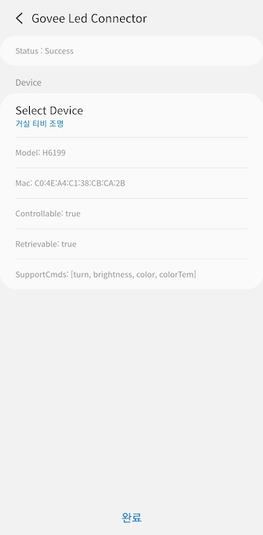
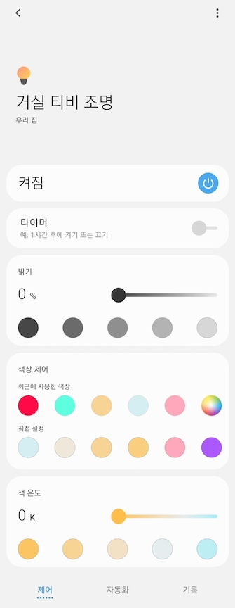

# Govee DTH and Smartapp
This app creates a virtual device to control govee led in SmartThings.

## Limitation
### Status Sync
The Govee API does not support webhook or any push so If the state has changed externally, there is no way to apply it.  
Instead, this DTH polls the state every miniute. Therefore, if you use govee device directly or other app, it may take up to 1 minute for the status to be applied.

### Rate Limit of API
From govee API doc. 
```
For all requests, the rate limit allows for up to 100 requests per minute. 
Requests are associated with the originating IP address.
```

If the smartthings server has one IP and multiple people use this DTH, it can cause problems.  
If the number of users increases, I will modify it to use own IP by using a private relay server such as Docker.  

## Pre Requirement
### Govee API Key
You can get the API key in govee official app.  

## Install
### Add Repository
SmartThings Groovy IDE site https://graph.api.smartthings.com/  
Add github repo to both "My SmartApps" and "My Device Handlers"
- add owner : obmaz / name : govee_led_connector / branch : main


### Publish DTH and SmartApp
Publish DTH : devicetypes/imageafter45121/govee-led.src/govee-led.groovy  
Publish SmartApp : smartapps/imageafter45121/govee-led-connector.src/govee-led-connector.groovy

## Run Smartapp
Add and Run SmartApp in your device to create virtual device.  

* SmartApp Screen




* Device UI Screen



## Support Devices
Test Device : H6199  
  
H6160, H6163,
H6104, H6109, H6110, H6117, H6159, H7022, H6086, H6089, H6182,
H6085, H7014, H5081, H6188, H6135, H6137, H6141, H6142, H6195,
H7005, H6083, H6002, H6003, H6148, H6052, H6143, H6144, H6050,
H6199, H6054, H5001, H6050, H6154, H6143, H6144, H6072, H6121,
H611A, H5080, H6062, H614C, H615A, H615B, H7020, H7021, H614D,
H611Z, H611B, H611C, H615C, H615D, H7006, H7007, H7008, H7012,
H7013, H7050, H6051, H6056, H6061, H6058, H6073, H6076, H619A,
H619C, H618A, H618C, H6008, H6071, H6075 , H614A, H614B, H614E,
H618E, H619E

## Reference
Govee API : https://govee-public.s3.amazonaws.com/developer-docs/GoveeAPIReference.pdf
